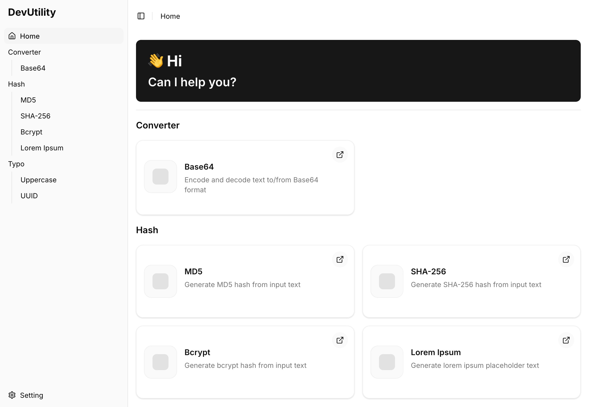

# Dev Utility



A powerful developer utility application that provides a collection of essential tools for developers, including generators (UUID, Lorem Ipsum) and transformers (Base64, Hashing, Text manipulation).

## Features

- **Generator Tools**: Generate various content like UUIDs, Lorem Ipsum text, and more
- **Transformer Tools**: Convert and transform data between different formats
- **Categories**:
  - **Hash**: MD5, SHA256, Bcrypt
  - **Typo**: UUID, Lorem Ipsum, Upper Case
  - **Converter**: Base64 encoding/decoding
- Modern React application with TypeScript
- Built with TanStack Router for file-based routing
- Styled with Tailwind CSS and Radix UI components
- Responsive design with dark mode support

## Tech Stack

- **Frontend**: React 19, TypeScript
- **Routing**: TanStack Router
- **Styling**: Tailwind CSS, Radix UI
- **Build Tool**: Vite
- **Testing**: Vitest

## Getting Started

### Prerequisites

- Node.js (v18 or higher)
- npm or yarn

### Installation

```bash
# Install dependencies
npm install
```

### Development

```bash
# Start development server
npm run dev

# The app will be available at http://localhost:3000
```

### Build

```bash
# Build for production
npm run build

# Preview production build
npm run preview
```

### Testing

```bash
# Run tests
npm run test
```

### Code Quality

```bash
# Lint code
npm run lint

# Format code
npm run format

# Run both linting and formatting
npm run check
```

## Key Points

### Architecture

The application is built with a modular tool system that allows easy addition of new utilities:

- **Tool Types**:
  - `GeneratorTool`: Tools that generate content from scratch
  - `TransformerTool`: Tools that transform input data into different formats

- **Transformer Categories**:
  - `OneWayTransformerTool`: Single-direction transformation
  - `TwoWayTransformerTool`: Bidirectional transformation (e.g., encode/decode)

- **Tool Registry**: Central registry for managing all available tools

### Project Structure

```
src/
├── components/          # React components
│   ├── tool/           # Tool-specific components
│   └── ui/             # Reusable UI components
├── hooks/              # Custom React hooks
├── lib/
│   ├── extensions/
│   │   └── tools/      # Tool implementations
│   │       ├── converter/    # Converter tools (Base64)
│   │       ├── hash/         # Hash tools (MD5, SHA256, Bcrypt)
│   │       └── typo/         # Text tools (UUID, Lorem, etc.)
│   └── tools/          # Tool core architecture
│       ├── generator/  # Generator tool framework
│       ├── transformer/ # Transformer tool framework
│       └── registry/   # Tool registry
└── routes/             # TanStack Router routes
```

## Contributing

Contributions are welcome! The most common way to contribute is by adding new tools. Below are detailed guides on how to create Generator Tools and Transformer Tools.

### Creating a Generator Tool

Generator tools create content from scratch without requiring input. Examples include UUID generators, Lorem Ipsum generators, etc.

#### Step 1: Create the Generator Tool

Create a new file in the appropriate category directory under `src/lib/extensions/tools/`. For example, to create a timestamp generator:

```typescript
// src/lib/extensions/tools/typo/timestamp.ts

import { createGeneratorTool } from '@/lib/tools/generator/factory'

export const timestampConversion = createGeneratorTool<string>({
  id: 'timestamp',
  name: 'Timestamp',
  description: 'Generate current Unix timestamp',
  category: 'Typo',
  generate: () => {
    return Date.now().toString()
  },
})
```

#### Step 2: Export the Tool

Add the export to the category's index file:

```typescript
// src/lib/extensions/tools/typo/index.ts

export * from './lorem'
export * from './upper-case'
export * from './uuid'
export * from './timestamp' // Add this line
```

#### Step 3: Register the Tool

Register the tool in the registry file:

```typescript
// src/lib/extensions/tools/register.ts

import {
  base64Conversion,
  bcryptConversion,
  loremConversion,
  md5Conversion,
  sha256Conversion,
  upperCaseConversion,
  uuidConversion,
  timestampConversion, // Add this import
} from '.'

// Register all tools
registry.register(base64Conversion)
registry.register(md5Conversion)
registry.register(sha256Conversion)
registry.register(bcryptConversion)
registry.register(upperCaseConversion)
registry.register(loremConversion)
registry.register(uuidConversion)
registry.register(timestampConversion) // Add this line
```

#### Step 4: Define Category (if needed)

If you're creating a new category, add it to the `ToolCategory` type:

```typescript
// src/lib/tools/types.ts

export type ToolCategory = 'Hash' | 'Typo' | 'Converter' | 'YourNewCategory'
```

#### Generator Tool Interface

```typescript
interface GeneratorTool<T> {
  type: 'generator'
  id: string // Unique identifier (e.g., 'uuid')
  name: string // Display name (e.g., 'UUID Generator')
  description?: string // Optional description
  category: ToolCategory // Category for grouping
  generate(): T | Promise<T> // Function that generates the content
}
```

### Creating a Transformer Tool

Transformer tools convert input data into different formats. They come in two types:

- **OneWay**: Single direction transformation (e.g., Text → Uppercase)
- **TwoWay**: Bidirectional transformation (e.g., Base64 encode/decode)

#### Step 1: Create the Transformer Tool

Create a new file in the appropriate category directory. Here are examples for each type:

##### One-Way Transformer

```typescript
// src/lib/extensions/tools/typo/lower-case.ts

import { createOneWayTransformerTool } from '@/lib/tools/transformer'

export const lowerCaseConversion = createOneWayTransformerTool<string, string>({
  id: 'lower-case',
  name: 'Lower Case',
  description: 'Convert text to lowercase',
  category: 'Typo',
  inputLabel: 'Text',
  outputLabel: 'Lower Case',
  transform: (input) => input.toLowerCase(),
})
```

##### Two-Way Transformer

```typescript
// src/lib/extensions/tools/converter/url-encode.ts

import { createTwoWayTransformerTool } from '@/lib/tools/transformer'

function urlEncode(text: string): string {
  return encodeURIComponent(text)
}

function urlDecode(text: string): string {
  return decodeURIComponent(text)
}

export const urlEncodeConversion = createTwoWayTransformerTool<string, string>({
  id: 'url-encode',
  name: 'URL Encode',
  description: 'Encode and decode URLs',
  category: 'Converter',
  a: {
    label: 'URL',
    convert: urlEncode,
  },
  b: {
    label: 'Encoded',
    convert: urlDecode,
  },
})
```

#### Step 2: Export and Register

Follow the same steps as for Generator Tools:

1. Add export to category index file
2. Import and register in `src/lib/extensions/tools/register.ts`

#### Transformer Tool Interfaces

```typescript
// One-Way Transformer
interface OneWayTransformerTool<TInput, TOutput> {
  type: 'transformer'
  variant: 'one-way'
  id: string
  name: string
  description?: string
  category: ToolCategory
  inputLabel: string
  outputLabel: string
  transform(input: TInput): TOutput | Promise<TOutput>
}

// Two-Way Transformer
interface TwoWayTransformerTool<TA, TB> {
  type: 'transformer'
  variant: 'two-way'
  id: string
  name: string
  description?: string
  category: ToolCategory
  a: {
    label: string
    convert(input: TA): TB | Promise<TB>
  }
  b: {
    label: string
    convert(input: TB): TA | Promise<TA>
  }
}
```

### Best Practices

1. **Tool IDs**: Use kebab-case for unique identifiers (e.g., 'base64', 'url-encode')
2. **TypeScript**: Always use proper TypeScript types for input and output
3. **Error Handling**: Handle potential errors in your transformation/generation logic
4. **Async Operations**: Use async/await if your operations are asynchronous
5. **Validation**: Validate inputs when necessary (especially for transformers)
6. **Documentation**: Add clear descriptions for tools
7. **Category Placement**: Choose the most appropriate category or create a new one

### Testing Tools

When adding new tools, ensure you test them:

```bash
# Run existing tests
npm run test
```

You can create test files in the appropriate `__tests__` directories following the project's testing conventions.

### Code Style

This project uses ESLint and Prettier for code formatting:

```bash
# Check and fix code style
npm run check
```

## License

This project is private and proprietary.

## Support

For issues, questions, or contributions, please refer to the project maintainers.
